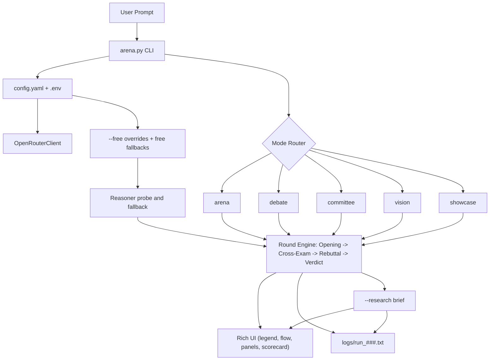

# ModelArena

ModelArena is a terminal-first multi-agent reasoning arena powered by OpenRouter.
It lets you watch specialized agents debate in real time, score the reasoning quality, and produce a final judged answer with transparent tradeoffs.

## Why ModelArena

- Structured agent workflow instead of one-shot replies
- Camera-friendly terminal UI built with Rich
- Dynamic model fallback when selected models are unavailable
- Cost-aware operation with a dedicated `--free` mode
- Research-oriented post-run synthesis with `--research`

## Agent Roles

- `Hunter Alpha` -> Strategist (`cyan`)
- `NVIDIA Nemotron` (or fallback reasoner model) -> Reasoner (`green`)
- `Healer Alpha` -> Critic (`red`)
- `Gemini Flash Lite` (or fallback analyst model) -> Analyst/Judge (`yellow`)
- `Qwen3.5-VL` -> Vision Interpreter (`magenta`)

ModelArena automatically updates displayed identity when a role switches models (for example, Nemotron -> DeepSeek fallback).

## Debate Protocol

Every mode follows explicit rounds for readability:

1. Opening
2. Cross-Exam
3. Rebuttal
4. Verdict

Verdict always includes:

- `Correctness`
- `Clarity`
- `Evidence Quality`
- `Risk Flags`
- `Winner`
- `Takeaway`
- `Final Answer`

## Architecture



## Project Structure

```text
modelarena/
├── arena.py
├── agents.py
├── openrouter_client.py
├── ui.py
├── config.yaml
├── requirements.txt
├── logs/
└── README.md
```

## Quick Start

From the `modelarena/` directory:

```bash
python3 -m venv .venv
source .venv/bin/activate
pip install -r requirements.txt
```

Create `.env`:

```env
OPENROUTER_API_KEY=your_openrouter_api_key
```

Run:

```bash
python arena.py
```

## CLI Modes

| Mode | Command | Purpose |
| --- | --- | --- |
| Arena (default) | `python arena.py` | Full strategist -> reasoner -> critic -> revision -> judge pipeline |
| Debate | `python arena.py debate` | Compact 4-step reasoning debate |
| Committee | `python arena.py committee` | Multi-angle opening before critique/judgment |
| Vision | `python arena.py vision image.png` | Visual interpretation + reasoning debate |
| Showcase | `python arena.py showcase --theme neon` | Live “control-room” layout for demos/posts |

## CLI Flags

| Flag | Example | What it does |
| --- | --- | --- |
| `--question` | `--question "Should UBI be adopted?"` | Non-interactive run |
| `--theme` | `--theme sunset` | Showcase theme (`neon`, `sunset`, `classic`) |
| `--free` | `python arena.py debate --free --question "..."` | Forces free counterparts and free fallbacks |
| `--research` | `python arena.py arena --research --question "..."` | Adds a post-run research brief |

## Free Mode (`--free`)

`--free` switches each role to `free_models` in `config.yaml` when needed, then probes and applies `free_fallbacks` for the reasoner.

Important behavior:

- If your preferred free model is capped/unavailable, ModelArena auto-falls back.
- UI and transcript always show the active model actually used.
- If your OpenRouter account-level free quota is fully exhausted, some runs may still fail depending on provider limits.

## Research Mode (`--research`)

After normal debate completion, ModelArena generates a `Research Brief` panel with:

- Working Answer
- Confidence score
- Top Claims
- Evidence Quality
- Counterarguments
- Open Questions
- Next Experiments
- Search Queries

This is useful when using ModelArena as a lightweight research copilot, not just a demo UI.

## Configuration

Edit `config.yaml` to control paid/default and free-mode behavior:

```yaml
models:
  strategist: openrouter/hunter-alpha
  reasoner: nvidia/nemotron-3-super-120b-a12b:free
  critic: openrouter/healer-alpha
  analyst: google/gemini-3.1-flash-lite-preview
  vision: qwen/qwen3-vl-8b-instruct

fallbacks:
  reasoner:
    - deepseek/deepseek-chat-v3-0324
    - google/gemini-2.0-flash-001

free_models:
  strategist: openrouter/hunter-alpha
  reasoner: nvidia/nemotron-3-super-120b-a12b:free
  critic: openrouter/healer-alpha
  analyst: openrouter/hunter-alpha
  vision: nvidia/nemotron-nano-12b-v2-vl:free

free_fallbacks:
  reasoner:
    - nvidia/nemotron-3-nano-30b-a3b:free
    - openrouter/hunter-alpha
    - openrouter/healer-alpha
    - meta-llama/llama-3.3-70b-instruct:free
```

All values are loaded at runtime, no code edits required.

## Logging and Artifacts

- Every run is saved to `logs/run_###.txt`
- Logs include timestamp, mode, question, active model mapping, and full transcript
- When enabled, research brief is included in transcript history

## Recording / Social Showcase

Record a live showcase session:

```bash
asciinema rec --command "python arena.py showcase --question 'Should startups begin with monoliths?' --theme neon"
```

Generate social-ready media:

```bash
./scripts/make_showcase_video.sh debate neon "Should remote work remain default?" my_clip
```

Outputs:

- `artifacts/my_clip.cast`
- `artifacts/my_clip.gif`
- `artifacts/my_clip.mp4`
- `artifacts/my_clip_poster.png`

## Troubleshooting

- `OPENROUTER_API_KEY is missing`
  - Ensure `.env` exists in `modelarena/` with the key set.
- `externally-managed-environment` when installing
  - Use local venv (`python3 -m venv .venv`) and install there.
- Free model `429` errors
  - Expected when provider daily free limit is hit. Configure additional free fallbacks or add OpenRouter credits.
- `404 No endpoints available ... privacy`
  - Check OpenRouter privacy/guardrail settings for your key.
- Misaligned UI in some terminals
  - Use ASCII tags: `MODELARENA_EMOJI=0 ...`
  - Disable spinner if needed: `MODELARENA_NO_SPINNER=1 ...`

## Example Commands

```bash
python arena.py --question "Build a GTM plan for an AI SaaS with $10k budget."
python arena.py debate --question "Should AI watermarking be mandatory by law?"
python arena.py committee --question "Monolith vs microservices for first 18 months?"
python arena.py vision /absolute/path/image.png --question "What strategic claim does this image make?"
python arena.py showcase --theme sunset --question "Is universal basic income viable?"
python arena.py debate --free --question "How should a student learn system design in 90 days?"
python arena.py arena --research --question "Should remote work remain default for software teams?"
python arena.py showcase --free --research --theme classic --question "Should frontier AI progress be paused?"
```

## Full Validation Prompt Suite

Use these to test every mode and flag with non-trivial prompts.

```bash
# Default arena
python arena.py --question "Design a 12-week roadmap for launching a profitable AI note-taking SaaS with a $5k budget. Include pricing, GTM, biggest risks, and first 3 experiments."

# Debate
python arena.py debate --question "Should governments mandate AI watermarking for all synthetic media? Give a policy recommendation with tradeoffs for free speech, enforcement, and misuse."

# Committee
python arena.py committee --question "You are advising a startup choosing between monolith and microservices for the next 18 months. Recommend architecture, migration triggers, and team/org constraints."

# Vision
python arena.py vision /absolute/path/image.png --question "What strategic decision is being debated in this image, what stance is presented, and what assumptions are implied?"

# Showcase
python arena.py showcase --theme sunset --question "Is universal basic income fiscally and socially viable in a mid-sized economy over 10 years?"

# Free mode
python arena.py debate --free --question "Create a practical AI adoption plan for a 30-person consultancy with strict privacy constraints and limited ML expertise."

# Research mode
python arena.py debate --research --question "Should remote work remain default for software teams? Provide policy tradeoffs for productivity, onboarding, and innovation."

# Combo stress test
python arena.py showcase --free --research --theme classic --question "Should frontier AI development pause until stronger alignment guarantees exist?"
```

## Media Index

Available media in `artifacts/`:

- `showcase.gif`
- `showcase.mp4`
- `showcase.cast`
- `showcase_poster.png`
- `showcase_debate.gif`
- `showcase_debate.mp4`
- `showcase_debate.cast`
- `showcase_quick.gif`
- `showcase_quick.mp4`
- `showcase_quick.cast`
- `showcase_quick_poster.png`

## Social Post Templates

### Launch Post

Built **ModelArena**, a terminal-native multi-agent reasoning arena.

Highlights:

- live rounds: Opening -> Cross-Exam -> Rebuttal -> Verdict
- judge scorecard with winner + takeaway
- dynamic model fallback when a model is unavailable
- `--free` mode for low-cost testing
- `--research` mode for hypothesis + experiment planning

### Feature Post (`--free`)

Shipped `--free` mode in ModelArena.

Now agent roles auto-switch to free counterparts and keep UI/transcript consistency.
If a free reasoner model is capped, configured free fallbacks are probed automatically.

### Feature Post (`--research`)

Added `--research` mode to ModelArena.

After the debate, it produces:

- confidence estimate
- strongest claims
- counterarguments
- open questions
- next experiments
- suggested search queries
